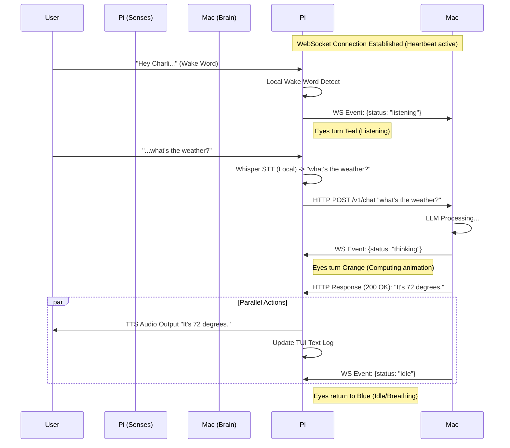

# C.H.A.R.L.I. Home — Engineering Proposal & Architecture
**Status:** DRAFT v1.0
**Owner:** Christian Bermeo ("Sir")
**Architect:** C.H.A.R.L.I.
**Date:** March 5, 2026

---

## 1. Executive Summary: "The Distributed Nervous System"

We are transitioning the CHARLI ecosystem from a "Centralized Brain with Remote Polling" to a **"Distributed Nervous System"**.

*   **The Head (Mac Mini):** Runs the core intelligence (OpenClaw), heavy reasoning (LLMs), and memory management.
*   **The Senses (Raspberry Pi 5):** Acts as the "Smart Hub." It handles local I/O (hearing, seeing, speaking, displaying) and maintains persistent awareness of the physical room.
*   **The Controller (MacBook):** Provides a command interface for Sir to inject instructions or query status from anywhere.

The connection backbone is **Tailscale**, creating a secure, flat mesh network where devices communicate as if they are side-by-side.

---

## 2. Communication Architecture: The Hybrid Model

We will use a **Hybrid HTTP + WebSocket** pattern. This optimizes for both transactional reliability and real-time responsiveness.

### 2.1 The Protocols
*   **HTTP (REST):** Used for *Transactional* events.
    *   *Example:* Pi sends transcribed text to Brain. Brain returns the final answer.
    *   *Why:* Request/Response is robust. If it fails, we retry.
*   **WebSockets (State Sync):** Used for *Ephemera* and *Presence*.
    *   *Example:* Brain tells Pi "I am thinking" (Pi starts animation). Brain tells Pi "CPU is high" (Pi updates HUD stats).
    *   *Why:* Low latency, bi-directional. Keeps the "Eyes" alive without constantly polling the API.

### 2.2 Token Usage & Cost Impact
*   **Do Sockets cost tokens?** **NO.** Maintaining a WebSocket connection is purely network traffic (bytes). It costs $0.00.
*   **Cost Driver:** Tokens are only consumed when the Mac Mini sends text to the LLM (Anthropic/Gemini) to generate an answer.
*   **Efficiency:** This model might actually *save* tokens because the Pi can handle "wake word rejection" locally without bothering the Brain, and the Brain can push "status updates" (like system health) using local scripts, not LLM generation.

### 2.3 Step-by-Step Flow (The "Hybrid" Loop)



---

## 3. User Interface: The Cyberdeck TUI

We will build a **Terminal User Interface (TUI)** running natively on the Pi.

*   **Aesthetic:** "Cyberdeck" / "Hard Sci-Fi".
    *   **Primary Colors:** Copper/Brass (#B87333), Amber (#FFB000), Deep Space Blue (#0B1026).
    *   **Style:** Monospaced, high contrast, scanlines (optional).
*   **Framework:** **Textual** (Python). It allows CSS-like styling for terminal apps and supports 60FPS animations.
*   **Terminal Emulator:** We do not need the *app* Ghostty on the Pi (it requires heavy GPU libraries). We will run the TUI directly in the lightweight system console or a minimal emulator like `Alacritty` or `fbterm` (FrameBuffer Terminal) to keep resources free for Whisper. The *animation style* will mimic Ghostty's fluid shaders using ASCII block characters.

### Layout Concept
```text
┌──────────────────────────────────────────────┐
│  CPU: 42°C  |  MEM: 12%  |  NET: TAILSCALE   │ <─ System Bar (Brass)
├──────────────────────────────────────────────┤
│                                              │
│            (  O  )      (  O  )              │ <─ Animated ASCIIEyes (White)
│                                              │
│           [ LISTENING... ]                   │
│                                              │
├──────────────────────────────────────────────┤
│ > [17:42] Wake word detected                 │ <─ Log Stream (Amber)
│ > [17:42] Transcribed: "Status report"       │
│ > [17:42] Incoming: Audio stream (240kbps)   │
└──────────────────────────────────────────────┘
```

---

## 4. Network & Accessibility

### 4.1 Tailscale Mesh (The "Home" Network)
*   **Concept:** A private, encrypted overlay network.
*   **Usage:**
    *   MacBook Terminal → `ssh charli@charli-home` (Manage the Pi).
    *   MacBook CLI → `charli-cli chat "Dinner is ready"` (Sends text to Pi TTS).
    *   MacBook CLI → `charli-cli report` (Queries Pi health sensors).
*   **Security:** High. Only devices signed into your Tailscale account can even *see* the Pi.

### 4.2 Cloudflare Tunnels (The "World" Access)
*   **What it is:** A secure way to expose a local web server to the public internet without opening ports on your router.
*   **Use Case:** If you build a React/Next.js dashboard for "Home Control," you can access it via `https://home.yourdomain.com` from a phone *without* Tailscale active.
*   **Auth (Cloudflare Access):** We put an identity shield in front of it. When you visit the URL, Cloudflare asks for your email/PIN or GitHub login *before* the request ever touches the Pi. GitHub login is the recommended method.
*   **Recommendation:** Start with Tailscale only (Simpler/Safer). Add Cloudflare Tunnel later if you need to give "Guest" access to someone without installing Tailscale on their device.

---

## 5. Development Workflow: Docker & CI/CD

We will treat the Pi as a **Production Environment**. You do not code *on* the Pi; you code *for* the Pi.

### 5.1 The Workflow
1.  **Dev (MacBook || Mac Mini):** You write code in VS Code.
2.  **Build:** `docker buildx build --platform linux/arm64 ...` (Builds the Pi container on your powerful Mac).
3.  **Push:** Push image to GitHub Container Registry (GHCR) or ECR (AWS Container Registry) TBD.
4.  **Deploy:** Pi pulls the new image and restarts the container.

### 5.2 Container Structure
We will use a **Multi-Container (Docker Compose)** setup on the Pi:

1.  **`charli-brain-link` (Backend):**
    *   FastAPI Server (WebSockets + HTTP).
    *   Whisper AI Engine.
    *   Hardware control (GPIO, Camera, Audio).
2.  **`charli-tui` (Frontend):**
    *   Textual App.
    *   Connects to `brain-link` via WebSocket (localhost) to get status/eyes.
    *   *Why separate?* If the UI crashes, the voice assistant still works. If the assistant lags, the UI doesn't freeze.

---

## 6. Next Steps

1.  **Repo Setup:** Convert `charli-home` into a proper repo structure with `docker-compose.yml`.
2.  **Prototype TUI:** Build a "Hello World" Textual app on your Mac to test the eye animations.
3.  **Prototype Sockets:** Create a simple script where the Mac Mini sends a "Blink" command and the TUI reacts.
