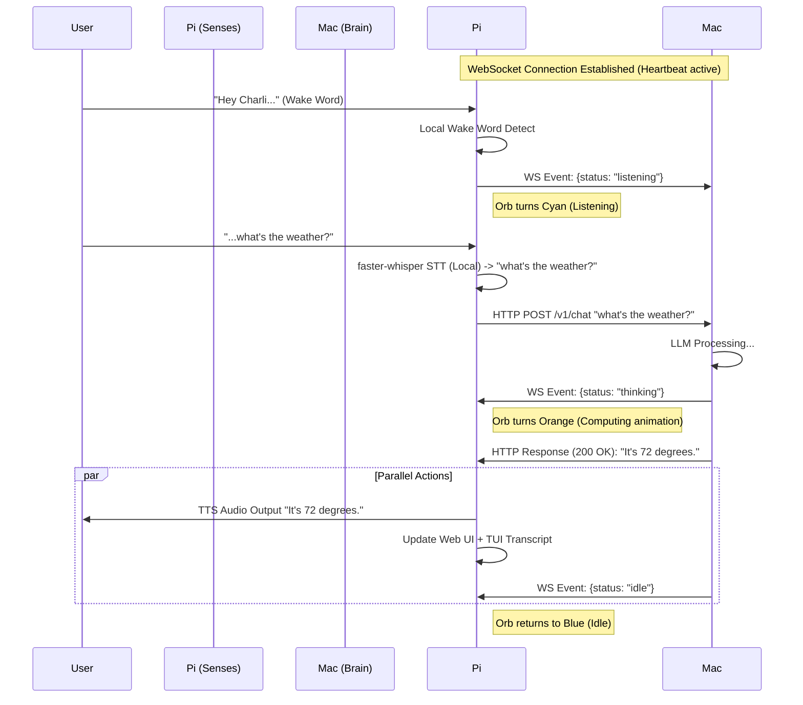

# C.H.A.R.L.I. Home — Engineering Proposal & Architecture
**Status:** v2.0 — Finalized
**Owner:** Christian Bermeo ("Sir")
**Architect:** C.H.A.R.L.I.
**Date:** March 12, 2026

---

## 1. Executive Summary: "The Distributed Nervous System"

We are transitioning the CHARLI ecosystem from a "Centralized Brain with Remote Polling" to a **"Distributed Nervous System"**.

*   **The Head (Mac Mini):** Runs the core intelligence (OpenClaw), heavy reasoning (LLMs), and memory management.
*   **The Senses (Raspberry Pi 5):** Acts as the "Smart Hub." It handles local I/O (hearing, seeing, speaking, displaying) and maintains persistent awareness of the physical room.
*   **The Controller (MacBook):** Provides a command interface for Sir to inject instructions or query status from anywhere.

The connection backbone is **Tailscale**, creating a secure, flat mesh network where devices communicate as if they are side-by-side.

---

## 2. Decision: HiWonder WonderEcho Module

**Verdict: NOT for CHARLI. Saved for a future robotics project.**

The WonderEcho ($20 I2C module) does offline command-word recognition — it matches ~300 pre-programmed words like "go forward." It **cannot transcribe free-form speech**. CHARLI needs to understand anything you say ("What's the weather?", "Tell me about black holes"), which requires Whisper STT. The built-in speaker is also too tiny for voice output. Perfect for a future robot arm/rover project.

---

## 3. Finalized Tech Stack

| Component | Tool | Why |
|---|---|---|
| **Wake Word** | Porcupine (pvporcupine) | Accurate, supports Spanish, proven on Pi 5. Migrate to openWakeWord when it adds Spanish. |
| **Recording** | `arecord` (ALSA subprocess) | Already works on the Pi (`hw:0,0`). Simple, reliable. |
| **Speech-to-Text** | **faster-whisper** (base, INT8) | 4x faster than openai-whisper on Pi 5, ~200MB less RAM, no PyTorch. Same accuracy. |
| **LLM Brain** | OpenClaw via OpenAI-compatible API | Runs on Mac Mini. Pi just sends text, gets text back. Token-efficient. |
| **Text-to-Speech** | **espeak-ng** (Phase 1) → **Piper TTS** (Phase 4) | Start robotic but instant. Upgrade to near-human voice once core pipeline works. |
| **Web UI** | FastAPI + vanilla HTML/CSS/JS | Primary UI. 800×480 JARVIS touchscreen in Chromium kiosk mode. |
| **TUI** | Textual (Python) | Secondary UI. SSH-accessible monitoring. Same WebSocket as web UI. |
| **State Sync** | WebSocket (FastAPI → browser/TUI) | Real-time state broadcast: IDLE/LISTENING/THINKING/SPEAKING |
| **Pi↔Mac Link** | HTTP (questions) + WebSocket (state) | HTTP for Q&A (reliable, retryable). WebSocket for live state sync (zero token cost). |
| **Deployment** | venv + systemd | Simplest. No Docker overhead. Revisit later if needed. |
| **Network** | Tailscale | Already set up. Secure mesh, Pi and Mac Mini on same private network. |

### Why faster-whisper over openai-whisper?

| | openai-whisper | faster-whisper |
|---|---|---|
| Transcribe 5s audio on Pi 5 | ~10-15 seconds | ~3-4 seconds |
| RAM usage | ~500MB (needs PyTorch) | ~300MB (CTranslate2, INT8) |
| Install size | ~2GB | ~300MB |
| Accuracy | Same | Same (identical model weights) |
| Python API | `whisper.load_model("base")` | `WhisperModel("base", compute_type="int8")` |

### RAM Budget (Pi 5, 8GB)

| Component | RAM |
|---|---|
| Linux + systemd | ~300MB |
| Chromium kiosk (1 tab) | ~250MB |
| faster-whisper (base, INT8) | ~300MB |
| FastAPI + uvicorn | ~50MB |
| Porcupine | ~15MB |
| Python + libs | ~80MB |
| **Total** | **~1GB** |
| **Free** | **~7GB** |

---

## 4. Communication Architecture: The Hybrid Model

We use a **Hybrid HTTP + WebSocket** pattern. This optimizes for both transactional reliability and real-time responsiveness.

### 4.1 The Protocols
*   **HTTP (REST):** Used for *Transactional* events.
    *   *Example:* Pi sends transcribed text to Brain. Brain returns the final answer.
    *   *Why:* Request/Response is robust. If it fails, we retry.
    *   *Endpoints:* `POST /api/speak`, `POST /api/ask`, `GET /api/status`, `GET /health`
*   **WebSockets (State Sync):** Used for *Ephemera* and *Presence*.
    *   *Example:* Brain tells Pi "I am thinking" (Pi starts animation). System metrics broadcast every 10s.
    *   *Why:* Low latency, bi-directional. Keeps the UI alive without constantly polling.

### 4.2 Token Usage & Cost Impact
*   **Do Sockets cost tokens?** **NO.** Maintaining a WebSocket connection is purely network traffic (bytes). It costs $0.00.
*   **Cost Driver:** Tokens are only consumed when `ask_charli()` sends text to the LLM.
*   **Efficiency:** Conversation context is capped at 3 turns (6 messages) to keep costs low while enabling follow-up questions.

### 4.3 Step-by-Step Flow



---

## 5. User Interface

### 5.1 Primary: JARVIS Web UI (Touchscreen)

The 7" touchscreen displays an animated JARVIS-style interface served by FastAPI in Chromium kiosk mode.

*   **Animated Orb:** Canvas-based blob with state-aware visual profiles (blue=idle, cyan=listening, orange=thinking, gold=speaking)
*   **Transcript:** Real-time conversation log with user (cyan) and CHARLI (amber) messages
*   **Status Bar:** Clock, connection status, system metrics
*   **Tech:** Vanilla HTML/CSS/JS — no build step, no framework

### 5.2 Secondary: Cyberdeck TUI (SSH)

A Textual-based Terminal UI accessible via SSH for monitoring and debugging.

*   **Aesthetic:** Copper/Brass (#B87333), Amber (#FFB000), Deep Space Blue (#0B1026)
*   **Features:** Live state display, conversation transcript, system metrics (CPU, RAM, Tailscale)
*   **Connection:** Same `/ws` WebSocket endpoint as the web UI
*   **Usage:** `python3 tui/charli_tui.py` or remote: `python3 tui/charli_tui.py --host charli-home`

---

## 6. Network & Accessibility

### 6.1 Tailscale Mesh (The "Home" Network)
*   **Concept:** A private, encrypted overlay network.
*   **Usage:**
    *   MacBook Terminal → `ssh charli@charli-home` (Manage the Pi).
    *   Mac can push commands to Pi via REST: `POST /api/speak` with "Dinner is ready"
    *   Mac can query Pi health: `GET /api/status`
*   **Security:** High. Only devices signed into your Tailscale account can even *see* the Pi.

### 6.2 Cloudflare Tunnels (Future — "World" Access)
*   **Use Case:** Phone access without installing Tailscale.
*   **Auth:** Cloudflare Access with GitHub login.
*   **Status:** Deferred. Start with Tailscale only.

---

## 7. Deployment: venv + systemd

We use a simple Python virtual environment + systemd service instead of Docker. This avoids container overhead on the Pi and simplifies debugging for a learning project.

### 7.1 Setup
```bash
python3 -m venv ~/charli-home/.venv
source ~/charli-home/.venv/bin/activate
pip install -r requirements.txt
```

### 7.2 systemd Service
```ini
[Unit]
Description=CHARLI Home Voice Assistant
After=network.target bluetooth.target

[Service]
User=charli
WorkingDirectory=/home/charli/charli-home
ExecStart=/home/charli/charli-home/.venv/bin/python3 charli_home.py
Restart=always
RestartSec=5
EnvironmentFile=/home/charli/.charli.env

[Install]
WantedBy=multi-user.target
```

### 7.3 Chromium Kiosk (autostart)
```bash
# ~/.config/autostart/charli-ui.desktop
[Desktop Entry]
Name=CHARLI UI
Exec=chromium-browser --kiosk --noerrdialogs --disable-infobars http://localhost:8080
```

---

## 8. Phased Milestone Roadmap

### Phase 1: Core Pipeline (Milestones 0-6)
- [x] Pi setup, repo clone, venv, dependencies
- [x] Recording (USB mic via arecord)
- [x] Transcription (faster-whisper, base, INT8)
- [x] LLM queries (OpenClaw via OpenAI client)
- [x] Text-to-speech (espeak-ng)
- [x] Wake word detection (Porcupine)
- [x] Full voice pipeline orchestrator

### Phase 2: User Interface (Milestone 7)
- [x] JARVIS web UI (animated orb + transcript)
- [x] WebSocket real-time state sync
- [x] Chromium kiosk auto-launch

### Phase 3: Intelligence Upgrades (Milestones 8-12)
- [ ] Voice Activity Detection (stop on silence)
- [x] Conversation context (3-turn memory)
- [x] Pi↔Mac nervous system (WebSocket + REST)
- [x] System monitoring (CPU, RAM, Tailscale)
- [x] TUI companion (Textual)

### Phase 4: Polish & Natural Voice
- [ ] Piper TTS (upgrade from espeak-ng)
- [ ] Conversation persistence (SQLite)
- [ ] Dashboard widgets (quick-action touch buttons)
- [ ] openWakeWord migration (when Spanish support arrives)

### Phase 5: Future Expansion
- [ ] Camera + vision ("What's on my desk?")
- [ ] Home automation (MQTT, smart lights)
- [ ] Cloudflare tunnel (phone access)
- [ ] Pomodoro timer
- [ ] Retro gaming (RetroPie)

---

## 9. Key Architecture Decisions

| Decision | Choice | Rationale |
|---|---|---|
| STT Engine | faster-whisper (not openai-whisper) | 4x faster, 200MB less RAM, no PyTorch |
| Primary UI | Web (not TUI) | Touchscreen demands it; TUI is secondary for SSH |
| Deployment | venv + systemd (not Docker) | Simpler for learning project, less Pi overhead |
| Context Window | 3 turns max | Balances follow-up ability vs token cost |
| Mic Device | hw:0,0 (not plughw:1,0) | Confirmed working on this Pi's USB mic |
| HiWonder | Skip | Command-word only, can't do free-form speech |
